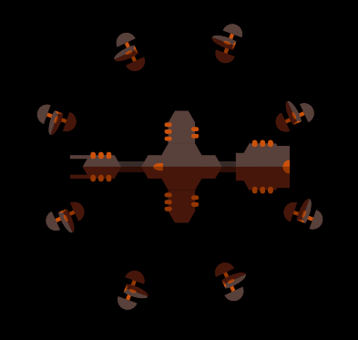

# Dodge Shuttle
Need [RU?](README.md)
## [ENG]

Dodge Shuttle is an endless arcade runner game.

The player controls a spaceship that can move and shoot.
The player's task is extremely simple - to fly as far as possible. However, this is not so easy to do,
after all, various opponents will appear on the way. When a player is hit, the player's ship lights up.
A second hit destroys the ship.

### Enemies

#### Asteroid

The asteroid is flying in a straight line to the left. Rather an obstacle than an enemy.

Danger: low

#### Swarm

A group of opponents making wave-like movements.

Danger: low

#### Rusher

Takes 3 shots, then tries to ram the player. On an unsuccessful attempt, it flies to the left.

Danger: normal

#### Defender

Takes several shots, then flies to the right.

Danger: normal

#### Dragonfy

Plants 3 mines at random points, then flies to the left

Danger: high

#### Mine

In the deactivated state, the behavior is similar to that of an asteroid.
When a bullet hits (be it a player's or enemy's bullet), it is activated.
When activated, the mine starts to rotate and shoot. Since the mine can be activated
another mine, the player needs to take special care when it appears and a dragonfly appears.

A mine can't be destroyed by a bullet

Danger: high

#### Minefield

Group of several mines

Activating at least one mine will result in an almost 100% chance of activating the entire field.

Danger: avengers level threat

### Bosses

#### Battle Barge

It is armed with 2 turrets leading aimed fire at the player.

When damaged, loses turret and increases movement speed.

#### Space Taker

Can throw asteroids. Periodically surrounds himself with a shield from the swarm.

In case of large damage, it causes a swarm.

#### Gexon

Armed with two turrets that aim at the player. Can spawn a torpedo.

When damaged, loses turret and increases movement speed.
In case of large damage, it spawns a torpedo salvo.

##### Torpedo

Has 2 states: activated and not activated.

In an unactivated state, it aims at the player and begins to converge.
With a sufficiently small distance, the

When activated, the torpedo can no longer maneuver.

It is impossible to shoot down a torpedo. The only way to avoid so much is to wait
activate torpedoes and dodge.

### Loot

#### Repair Kit

Repairs the player's ship when damaged

Drops From:
+ Asteroid (15 %)
+ Swarm (5 %)
+ Rusher (10 %)
+ Dragonfy (20 %)

#### Immunity

Imposes a shield on the player for 5 seconds.
For the duration of the shield, the player becomes invulnerable.

Can be used to destroy mines and torpedoes.

Items do not drop when destroyed in this way.

Drops From:
+ Defender (5 %)

#### Upgrade Kit

Improves the player's ship.

Drops From:
+ Defender (10 %)
+ Dragonfy (10 %)
+ All Bosses (100 %)

### Player upgrades

Improvements allow you to increase parameters such as speed, number of weapons, reload speed and
bullet flight speed.

#### MK1

##### Single

Starting variant of the ship. Has 1 cannon.

##### Double

Has 2 cannon.

##### Penta

Has 5 cannon.

#### MK2

##### Single

Has 1 cannon.

##### Double

Has 2 cannon.

##### Penta

Has 5 cannon.

#### MK3

Improvements to MK3 and beyond are significantly different from the previous ones.
The main difference is the presence of automatic turrets. Turrets choose their target and fire at it.

##### Single

Has 1 cannon and 2 turrets.

##### Triple

Has 3 cannon and 2 turrets.

#### MK4

Final upgrade.
Has 3 cannon and 5 turrets.

 
