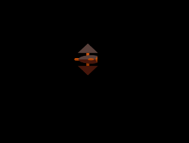
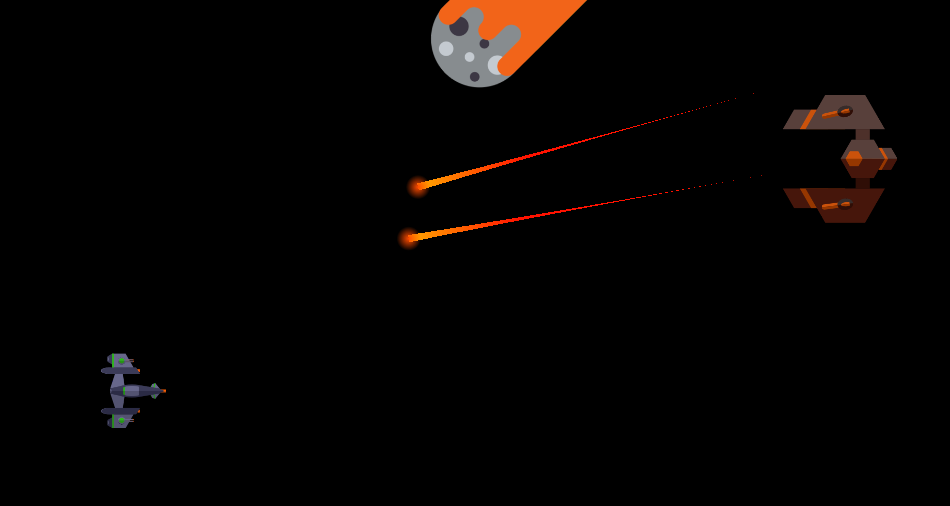
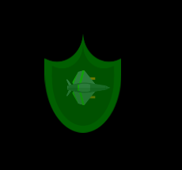
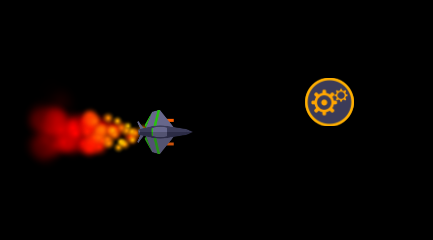
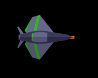
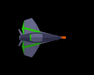
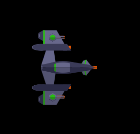

# Dodge Shuttle
Need [ENG?](ENG.md)
## [RU]

Dodge Shuttle - это бесконечная раннер-аркада.

Игрок управляет космическим кораблем, который может перемещаться и стрелять.
Задача игрока предельно проста - пролететь как можно дальше. Однако сделать это не так просто,
ведь на пути будут появляться различные противники. При попадании по игроку, корабль игрока загорается.
Повторное попадание уничтожает корабль.

### Противники

#### Астероид

Астероид летит по прямой влево. Скорее является преградой, чем противником.

Опасность: низкая

#### Рой

Группа противников, совершающих волнообразные движения.

Опасность: низкая

#### Рашер

Совершает 3 выстрела, после пытается протаранить игрока. При неудачной попытке улетает влево.

Опасность: умеренная

#### Дефендер

Совершает несколько выстрелов, после улетает вправо.

Опасность: умеренная

#### Стрекоза

Устанавливает 3 мины в случайных точках, после улетает влево

Опасность: высокая

#### Мина

В деактивированном состоянии поведение схоже с поведением астероида.
При попадании снаряда (будь то снаряд игрока или противника) активируется.
При активации мина начинает вращаться и стрелять. Поскольку мина может быть быть активирована
другой миной, игроку необходимо проявлять особую осторожность при ее появлении и появлении стрекозы.

Мина не может быть уничтожена снарядом

Опасность: высокая

#### Минное поле

Группа из нескольких мин

Активация хотя бы одной мины приведет к почти 100% вероятности активации всего поля.

Опасность: угроза уровня мстителей

### Боссы

#### Боевая Баржа

Имеет на вооружении 2 туррели ведущих прицельный огонь по игроку.

При повреждениях теряет туррели и увеличивает скорость перемещения.

#### Space Taker

Может выбрасывать астероиды. Периодически окружает себя щитом из роя.

При больших повреждениях вызывает рой.

#### Гексон

Вооружен двумя туррелями ведущими прицельный огонь по игроку. Может вызвать торпеду.

При повреждениях теряет туррели и увеличивает скорость перемещения.
При больших повреждениях вызывает торпедный залп.

##### Тореда

Имеет 2 состояния: активированное и не активированное.

В не активированном состоянии наводится на игрока и начинает сближение.
При достаточно малой дистанции активируется

В активированном состоянии торпеда больше не может маневрировать.

Сбить торпеду невозможно. Единственный способ избежать столькновения - дождаться
активации торпеды и увернуться.

### Предметы

#### Ремонтный набор

Чинит корабль игрока при повреждениях

Выпадает с:
+ Астероид (15 %)
+ Рой (5 %)
+ Рашер (10 %)
+ Стрекоза (20 %)

#### Щит

Накладывает на игрока щит существующий 5 секунд.
На время действия щита игрок становится неуязвимым.

Может быть использован для уничтожения мин и торпед.

При уничтожении таким образом предметы не выпадают.

Выпадает с:
+ Дефендер (5 %)

#### Набор улучшения

Улучшает корабль игрока.

Выпадает с:
+ Дефендер (10 %)
+ Стрекоза (10 %)
+ Все боссы (100 %)

### Улучшения игрока

Улучшения позволяют увеличить такие параметры как скорость, количество вооружения, скорость перезарядки и
скорость полета снаряда.

#### MK1

##### Single

Стартовый вариант корабля. Имеет 1 пушку.

##### Double

Имеет 2 пушки.

##### Penta

Имеет 5 пушек

#### MK2

##### Single

Имеет 1 пушку.

##### Double

Имеет 2 пушки.

##### Penta

Имеет 5 пушек

#### MK3

Улучшение MK3 и последующие значительно отличаются от предыдущих.
Главное отличие - наличие автоматических туррелей. Туррели сами выбирают цель и ведут по ней огонь.

##### Single

Имеет 1 пушку и 2 туррели.

##### Triple

Имеет 3 пушки и 2 туррели.

#### MK4

Финальная модернизация.
Имеет 3 пушки и 5 туррелей.

